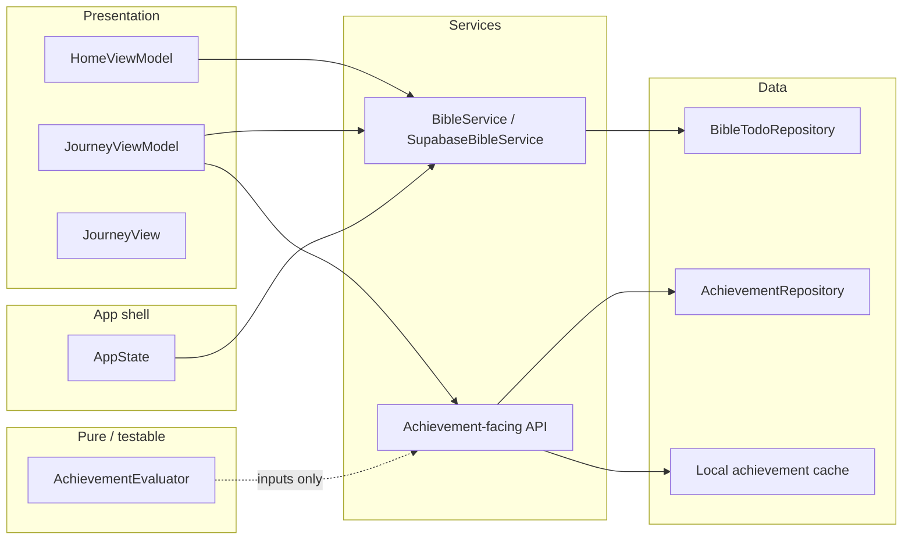

# Achievement System — Architecture Research (Integration Dimension)

**Project:** Bible Life (Bible Life achievement milestone)  
**Researched:** 2026-04-12  
**Scope:** How achievement/gamification layers integrate with existing iOS app architectures, mapped to this repo’s composition root, `BibleService`, repository, and MVVM stack.

**Confidence:** **HIGH** for structural patterns (protocol boundaries, separation of streak source-of-truth vs achievement ledger); **MEDIUM** for ecosystem “best” libraries — this milestone should stay custom and thin to match existing Supabase/UserDefaults patterns.

---

## 1. How iOS Apps Usually Structure Achievements

Mature integrations share the same idea across MVVM, Clean-ish, or coordinator-heavy apps: **achievements are a separate concern from the metric they observe**.

| Concern | Role | Typical placement |
|--------|------|-------------------|
| **Progress / streak source of truth** | Computes or stores “how many days in a row,” task rows, etc. | Domain/repository (your `BibleTodoRepository` + `user_streaks`) |
| **Achievement ledger** | Records *which* discrete rewards were granted and when (immutable once earned) | Separate table + local cache (your planned `user_achievements` + `UserDefaults`) |
| **Evaluation** | Pure(ish) logic: given current metrics + ledger → newly unlocked | Stateless type or use case (easy to unit test) |
| **Orchestration** | Runs evaluation after a known lifecycle point, persists unlocks, notifies UI | Service façade (`BibleService` extension or sibling protocol) or composition root wiring |
| **Presentation** | Shows collection, reacts to “just unlocked” | `JourneyViewModel` + `JourneyView`, toast at `HomeViewModel` / root |

Community and write-ups converge on **event- or outcome-driven evaluation**: after a meaningful action completes successfully, run “did this change any thresholds?” rather than polling everywhere ([SwiftfulGamification](https://github.com/SwiftfulThinking/SwiftfulGamification)-style event feeds; [gamification architecture discussion](https://thechosenvictor.com/blog/gamification-architecture) on separating XP/streaks from collectible achievements). Your product doc already picks the right trigger: **after successful task completion that updates the streak**.

**Anti-pattern for your constraints:** embedding badge rules inside `completeTask` SQL or mutating streak semantics to “also write achievements.” That couples two lifecycles and makes rollbacks risky.

---

## 2. Bible Life — Current Architecture (Anchor)

From `.planning/codebase/ARCHITECTURE.md` and code inspection:

- **Composition root:** `AppState` selects `BibleService` implementation after auth.
- **Feature API:** `BibleService` (`Services.swift`) — views/view models do not touch `SupabaseClient`.
- **Remote persistence:** `BibleTodoRepository` — `completeTask` updates tasks and streaks; **`completeTask` already returns `StreakInfo`** (post-completion snapshot).
- **Today’s flow:** `HomeViewModel` → `service.syncTaskCompletion(...)` (fire-and-forget `Task` today); streak display on Journey uses `fetchStreakSummary()`.
- **Gap relevant to achievements:** `SupabaseBibleService.syncTaskCompletion` currently **discards** the `StreakInfo` return value (`_ = try await repository.completeTask(...)`). Threading that value through is the lowest-friction way to evaluate milestones **without** an extra round trip.

---

## 3. Target Integration — Major Components & Boundaries

### 3.1 Component responsibilities

| Component | Responsibility | Must NOT |
|-----------|----------------|----------|
| **`BibleTodoRepository`** | `user_tasks`, `user_streaks`, existing streak math | Know about badges, UI, or achievement tiers |
| **`AchievementRepository` (new)** | CRUD/sync for `user_achievements` (Supabase) | Reimplement streak logic |
| **`AchievementEvaluator` (new)** | Given `currentStreak` (or equivalent) + set of earned milestone keys → `Set` of newly earned | Touch network or `UserDefaults` |
| **`AchievementService` or extended `BibleService`** | After successful complete: load earned IDs (cache-first), run evaluator, persist new rows locally + remote, expose `AsyncStream` or callback/`@Published` for “new unlock” | Change how streaks are calculated |
| **`AppPersistence` extension or parallel keys** | Fast read of “earned milestone IDs” for gating network | Replace Supabase as source of eventual truth for cross-device |
| **`HomeViewModel`** | Trigger completion path; optionally observe “unlocked now” for toast | Own achievement business rules |
| **`JourneyViewModel`** | Load badges for Journey section; refresh after tab focus or notification from shared state | Call `BibleTodoRepository` directly |

### 3.2 Two acceptable façade patterns

**Pattern A — Extend `BibleService` (recommended for minimal new wiring)**  
Add methods such as `fetchEarnedAchievements()`, `syncAchievementsIfNeeded()`, and either:

- change `syncTaskCompletion` to return a small `TaskCompletionOutcome` that includes optional post-complete streak snapshot for `completed == true`, **or**
- add `evaluateStreakAchievements(afterCompletingWith streakSnapshot:)` called from the same place that today calls `syncTaskCompletion`.

View models keep a single dependency (`BibleService`).

**Pattern B — `AchievementService` protocol + inject alongside `BibleService`**  
`AppState` constructs both; `HomeViewModel` takes both. Clearer separation, slightly more constructor surface area.

**Recommendation for roadmap:** **Pattern A** unless achievement code grows large enough to warrant its own module.

---

## 4. Data Flow (Explicit Direction)

### 4.1 Streak update → achievement unlock → UI

1. **User completes task (UI):** `HomeViewModel` applies optimistic local completion (`AppPersistence` IDs) and calls `BibleService.syncTaskCompletion(..., completed: true)`.
2. **Streak update (unchanged logic):** `SupabaseBibleService` → `BibleTodoRepository.completeTask` → updates `user_tasks` / `user_streaks` → returns **`StreakInfo`** (current streak as seen by server).
3. **Achievement evaluation (additive):** Service layer receives `StreakInfo` (or fetches `StreakSummary` if you accept one extra call — worse for latency/cost). Loads **earned milestone IDs** from local cache; if cache miss or sync policy says so, merges from `AchievementRepository.fetchEarned(...)`.
4. **`AchievementEvaluator`:** Static milestones `{3,7,14,30,60,100,365}` ∩ streak value → subtract already-earned → output new tiers.
5. **Persistence:** For each new tier: append to local cache immediately; `AchievementRepository.upsert` to Supabase (order: local-first for snappy UI, background retry on failure is optional enhancement).
6. **UI — toast:** `HomeViewModel` (or shared `@Observable` / `@Published` holder) receives “unlocked: [tiers]” from step 5 and triggers subtle toast **once** per completion transaction.
7. **UI — Journey:** `JourneyViewModel.load` (or dedicated `loadBadges`) reads from same cache/service; optionally refreshes from remote on app launch per PROJECT.md.

**Direction summary:** *Downstream* from repository streak write → *sideways* into achievement persistence → *upstream* to ViewModels as read models / events. Streak tables never read achievement tables.

### 4.2 Cold start / reinstall

1. App launch / sign-in: `AchievementService` or `BibleService` pulls remote earned rows, merges into local cache (overwrite or union by `user_id` scope).
2. Journey and Home use cache for “already earned” to skip redundant evaluation work and network on every completion (per performance constraint in PROJECT.md).

---

## 5. Hooking Into Streak Tracking **Without** Modifying It

**What “do not modify streak tracking” should mean in code terms:**

| Safe (additive) | Unsafe (violates intent) |
|-----------------|---------------------------|
| Use **`StreakInfo` / `StreakSummary` as read-only inputs** after `completeTask` | Change SQL, triggers, or row shape of `user_streaks` for badges |
| Add **new** `user_achievements` table + repository | Encode badge state inside `user_streaks` columns |
| Call achievement code **after** `completeTask` succeeds in `SupabaseBibleService` | Fork `completeTask` into two divergent paths for “badge users” |
| Widen `BibleService` API to return completion metadata | Reimplement streak calculation in the client for badges |

**Concrete seam:** `SupabaseBibleService.syncTaskCompletion` — keep `repository.completeTask` body identical; **only** add code that consumes its return value and invokes achievement orchestration. `BibleTodoRepository.completeTask` implementation stays the streak source of truth.

**If you cannot change `BibleService` signature in one phase:** `HomeViewModel` can `fetchStreakSummary()` after `syncTaskCompletion` returns — functionally correct but an extra request; prefer threading `StreakInfo` through the service when possible.

---

## 6. Suggested Build Order (Dependencies)

1. **Models + milestone catalog** — enum or struct for the seven tiers; `Codable` DTOs for Supabase rows.
2. **`AchievementEvaluator` + unit tests** — pure function, no I/O.
3. **Local cache** — extend `AppPersistence` or dedicated small type with keys namespaced by user id if multi-account on device matters.
4. **`AchievementRepository`** — PostgREST for `user_achievements`; mirror error patterns from `BibleTodoRepository`.
5. **Orchestration in `SupabaseBibleService`** (or `AchievementService`) — wire evaluator + repos; define unlock event channel for UI.
6. **`BibleService` protocol + mocks** — `MockBibleService` / tests updated for new methods or return type.
7. **`JourneyViewModel` + UI** — badge strip using cached read model.
8. **`HomeViewModel` toast** — subscribe to unlock events from step 5.
9. **Launch sync** — merge remote → local in `AppState` bootstrap or first authenticated screen load.

Phases can group (1–3), (4–6), (7–9) but **evaluator before repository** keeps tests green early.

---

## 7. Roadmap / Phase Structure Hints

- **Early phase:** Domain + persistence contracts + evaluator tests (no UI).
- **Middle phase:** Supabase table + repository + service wiring + launch sync.
- **Late phase:** Journey UI + toast + polish.

**Research flags:** RLS policies and idempotent upserts on `user_achievements` deserve a short security/data phase note (not architecture-only).

---

## 8. Sources & Confidence

| Source | Use |
|--------|-----|
| `.planning/PROJECT.md`, `.planning/codebase/ARCHITECTURE.md` | Ground truth for Bible Life constraints |
| `BIBLE TODO/SupabaseBibleService.swift`, `BibleTodoRepository.swift`, `ViewModels.swift` | Actual hook points and `StreakInfo` return |
| [SwiftfulGamification](https://github.com/SwiftfulThinking/SwiftfulGamification) | Corroborates event-driven / protocol-backed gamification layering (not a dependency recommendation) |
| [Gamification architecture (SwipeClean write-up)](https://thechosenvictor.com/blog/gamification-architecture) | Achievements as discrete “collection layer” vs continuous metrics |

---

*Architecture research for achievement milestone — integration dimension only.*
