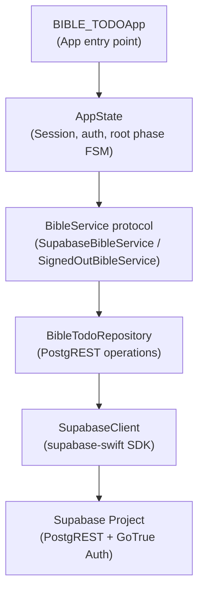
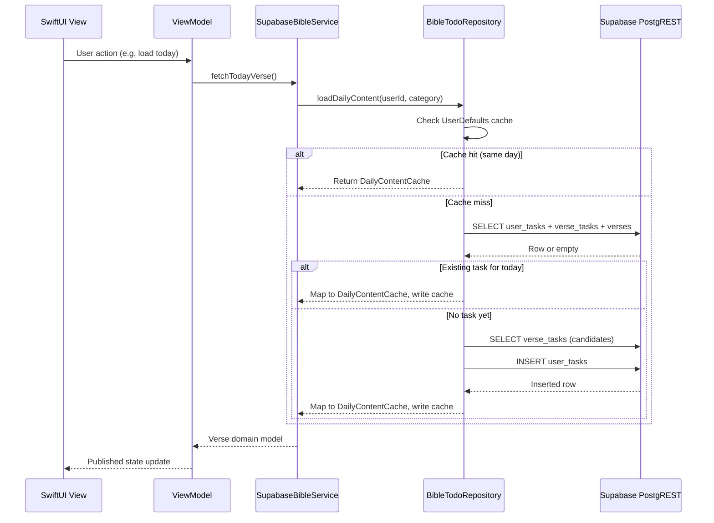
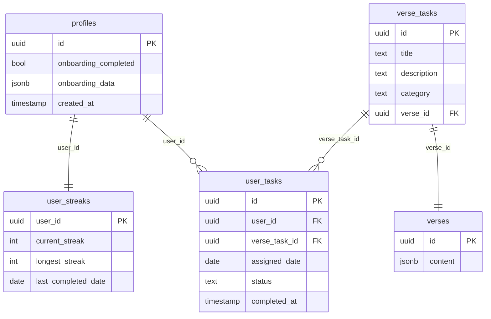
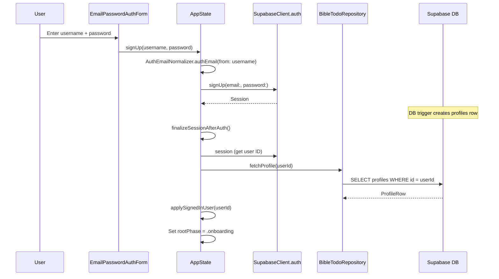
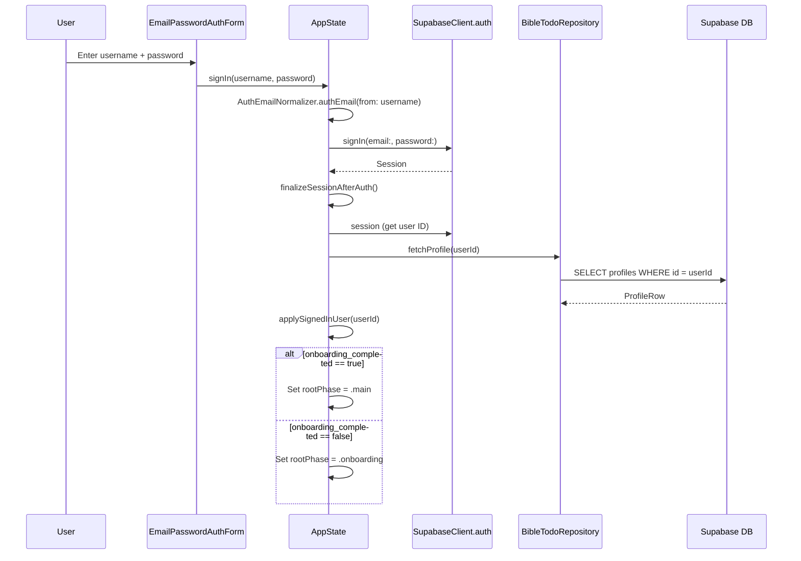
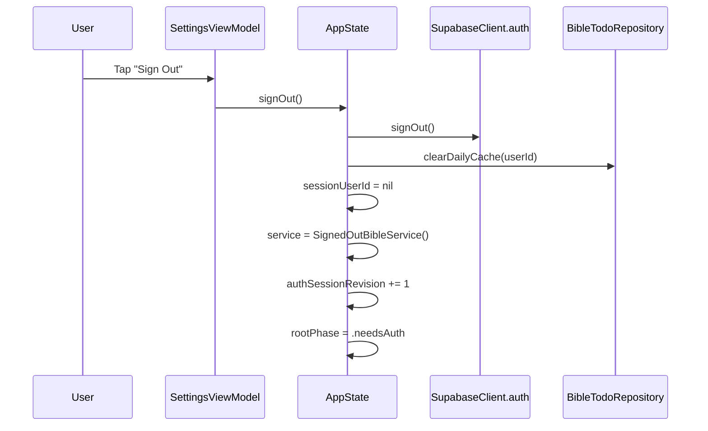
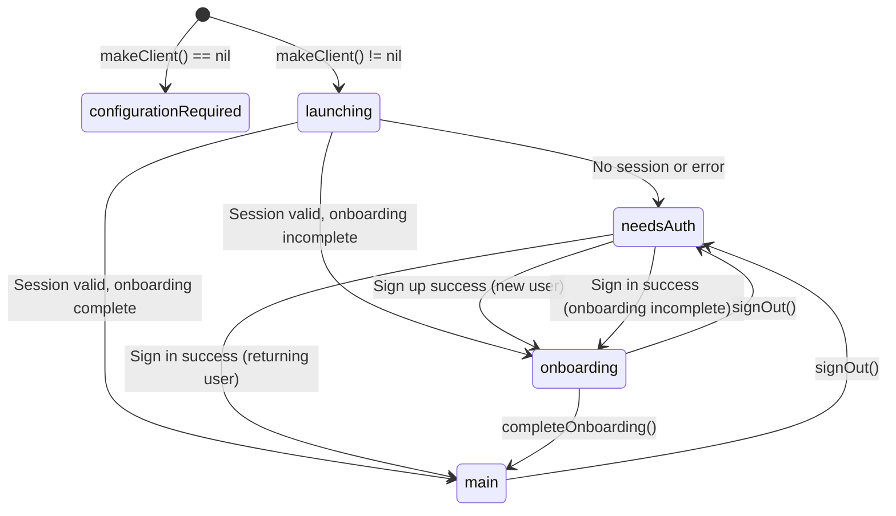

# Backend Implementation

This document describes the Supabase backend integration for the **Bible TODO** iOS app.
It covers configuration, database entities, authentication, API call sequences, caching,
and custom business logic. Use this as a reference when adding features or debugging
data-layer issues.

---

## Table of Contents

1. [Architecture Overview](#1-architecture-overview)
2. [Configuration and Client Initialization](#2-configuration-and-client-initialization)
3. [Database Entities](#3-database-entities)
4. [Authentication Flow](#4-authentication-flow)
5. [Root Phase State Machine](#5-root-phase-state-machine)
6. [Core API Call Sequences](#6-core-api-call-sequences)
7. [Caching Strategy](#7-caching-strategy)
8. [Custom Business Logic](#8-custom-business-logic)
9. [Error Handling](#9-error-handling)
10. [Adding New Features](#10-adding-new-features)

---

## 1. Architecture Overview

The backend follows a layered architecture. Each layer depends only on the layer
directly below it.



### Layer Responsibilities

| Layer | File | Role |
|---|---|---|
| App entry | `BIBLE_TODOApp.swift` | Creates `SupabaseClient` via `SupabaseConfig.makeClient()` and injects it into `AppState`. |
| State | `AppState.swift` | Owns the Supabase session, drives the root phase FSM, exposes `BibleService` to views. |
| Service | `SupabaseBibleService.swift` | Adapts `BibleTodoRepository` operations to the `BibleService` protocol consumed by view models. |
| Repository | `BibleTodoRepository.swift` | Contains every PostgREST query and mutation. The single source of truth for backend calls. |
| Client | `SupabaseConfig.swift` | Reads credentials from `Info.plist`, validates them, and builds the `SupabaseClient` instance. |

### Data Flow (View to Network)



---

## 2. Configuration and Client Initialization

Supabase credentials flow through the Xcode build system into the app bundle at
compile time. No `.env` files or runtime fetches are involved.

### Credential Injection Chain

```
Config/Secrets.xcconfig          (gitignored, developer-local)
    ↓ #include
Config/AppConfig.xcconfig        (checked in, declares SUPABASE_URL / SUPABASE_ANON_KEY)
    ↓ build settings
Info.plist                       ($(SUPABASE_URL) / $(SUPABASE_ANON_KEY) placeholders)
    ↓ Bundle.main.object(forInfoDictionaryKey:)
SupabaseConfig.makeClient()      (runtime)
```

### Validation (`SupabaseConfig`)

`SupabaseConfig.makeClient()` returns `nil` (instead of crashing) when any of the
following conditions are true:

- `SUPABASE_URL` or `SUPABASE_ANON_KEY` is missing or empty in `Info.plist`.
- The URL string cannot be parsed as a `URL`.
- The URL has no `host` component (guards against a force-unwrap inside the SDK).
- The URL scheme is not `http` or `https`.

When `makeClient()` returns `nil`, `AppState` sets `rootPhase = .configurationRequired`
and the app displays setup instructions instead of attempting network calls.

### Client Options

The client is created with one non-default option:

```swift
SupabaseClient(
    supabaseURL: url,
    supabaseKey: trimmedKey,
    options: .init(
        auth: .init(emitLocalSessionAsInitialSession: true)
    )
)
```

`emitLocalSessionAsInitialSession: true` causes the SDK to emit any locally cached
session synchronously on init, which `AppState` relies on during bootstrap to avoid
an extra network round-trip when the session is already stored in Keychain.

---

## 3. Database Entities

The app uses five Supabase tables. Each table has a corresponding Swift DTO in
`BibleTodoSupabaseModels.swift`.

### Entity Relationship Diagram



### Table Details

#### `profiles`

Stores user identity and onboarding state. Created automatically by a Supabase
database trigger when a new auth user signs up.

| Column | Type | Description |
|---|---|---|
| `id` | `uuid` (PK) | Matches `auth.users.id`. |
| `onboarding_completed` | `bool` | `true` after the user finishes onboarding. |
| `onboarding_data` | `jsonb` | Structured payload: `display_name`, `date_of_birth`, `gender`, `category`. |
| `created_at` | `timestamp` | Row creation time. |

**Swift DTOs:** `ProfileRow` (read), `ProfileOnboardingUpdate` / `OnboardingRemotePayload` (write).

#### `verses`

Each row holds one Bible verse (or verse range). The text and metadata live inside a
JSONB `content` column.

| Column | Type | Description |
|---|---|---|
| `id` | `uuid` (PK) | Verse identifier. |
| `content` | `jsonb` | Contains `text`, `reference`, `book`, `chapter`, `verse_start`, `verse_end`, `translation`, `display_order`, `is_active`. |

**Swift DTO:** `VerseContent` (decoded from the `content` JSONB), wrapped by `VerseResponse`.

#### `verse_tasks`

Links a Bible verse to a daily action task. Tasks are categorized by life stage
(e.g. `"default"`, `"student"`, `"parent"`).

| Column | Type | Description |
|---|---|---|
| `id` | `uuid` (PK) | Task identifier. |
| `title` | `text` | Short task name (e.g. "Love Someone Tangibly"). |
| `description` | `text` | Action description shown to the user. |
| `category` | `text` | Life-stage slug. Must match a `BibleLifeCategory` seeded slug. |
| `verse_id` | `uuid` (FK) | References `verses.id`. |

**Swift DTO:** `VerseTaskWithVerse` (includes nested `verses` join). Aliased as
`VerseTaskCandidate` when used during verse assignment.

#### `user_tasks`

Per-user daily task assignment. One row per user per day (enforced by application logic).

| Column | Type | Description |
|---|---|---|
| `id` | `uuid` (PK) | Row identifier. |
| `user_id` | `uuid` (FK) | References `profiles.id`. |
| `verse_task_id` | `uuid` (FK) | References `verse_tasks.id`. |
| `assigned_date` | `date` | Local calendar date as `YYYY-MM-DD`. |
| `status` | `text` | `"pending"` or `"completed"`. |
| `completed_at` | `timestamp` | ISO 8601 timestamp, `null` while pending. |

**Swift DTOs:** `UserTaskWithDetails` (read, includes nested joins), `UserTaskInsert`
(write), `ExistingTaskId` (lightweight read for exclusion queries).

#### `user_streaks`

One row per user, maintained by application-side logic (not database triggers).

| Column | Type | Description |
|---|---|---|
| `user_id` | `uuid` (PK) | References `profiles.id`. |
| `current_streak` | `int` | Consecutive days of completed tasks ending at `last_completed_date`. |
| `longest_streak` | `int` | All-time maximum streak. |
| `last_completed_date` | `date` | Most recent completion date (`YYYY-MM-DD`), or `null`. |

**Swift DTO:** `UserStreakRow`.

---

## 4. Authentication Flow

The app uses Supabase **email/password authentication** exclusively. A custom
`AuthEmailNormalizer` allows users to sign in with a plain username (no `@`) by
generating a synthetic email address.

### Username Normalization (`AuthEmailNormalizer`)

| Input | Output |
|---|---|
| `james` | `james@users.bibletodo.app` |
| `Jane.Doe` | `jane.doe@users.bibletodo.app` |
| `you@gmail.com` | `you@gmail.com` |

The normalizer lowercases the input, strips non-alphanumeric characters (except `.`,
`_`, `-`), and appends `@users.bibletodo.app` when the input contains no `@`.

### Sign Up Sequence



### Sign In Sequence



### Cold Launch (Bootstrap)

On every app launch, `AppState.init` calls `bootstrapSupabaseLaunch()`:

1. `repository.resolveAppLaunchState()` attempts `client.auth.session`.
2. If a valid session exists, it fetches the profile from `profiles`.
3. Based on `onboarding_completed`, it returns `.home`, `.onboarding`, or `.welcome`.
4. `AppState` transitions to the appropriate `rootPhase`.

If any step throws (expired session, network error), the app falls back to
`rootPhase = .needsAuth`.

### Sign Out



After sign-out, the `SignedOutBibleService` replaces `SupabaseBibleService`. All data
methods on `SignedOutBibleService` throw `BibleTodoRepositoryError.notAuthenticated`
immediately, preventing stale data access.

---

## 5. Root Phase State Machine

`AppState.rootPhase` drives the top-level UI in `ContentView`. The following diagram
shows all valid transitions:



| Phase | UI Shown | `BibleService` Active |
|---|---|---|
| `configurationRequired` | Setup instructions (missing Secrets.xcconfig) | None |
| `launching` | Loading spinner | None |
| `needsAuth` | `WelcomeAuthView` (sign in / sign up form) | `SignedOutBibleService` |
| `onboarding` | `OnboardingFlowView` (31-step flow) | `SupabaseBibleService` |
| `main` | Tab bar (`HomeView`, `JourneyView`, `SettingsView`) | `SupabaseBibleService` |

---

## 6. Core API Call Sequences

Every Supabase call goes through `BibleTodoRepository`. This section documents each
operation, the tables it touches, and the PostgREST method used.

### 6.1. `resolveAppLaunchState()`

**Purpose:** Determine where to send the user on cold launch.

| Step | Table | Operation | Columns / Filters |
|---|---|---|---|
| 1 | `auth.sessions` | `client.auth.session` | SDK-managed |
| 2 | `profiles` | SELECT (`.single()`) | `id, onboarding_completed, onboarding_data, created_at` WHERE `id = userId` |

**Returns:** `(LaunchDestination, UUID?)` -- one of `.welcome`, `.onboarding`, or `.home`.

### 6.2. `fetchProfile(userId:)`

**Purpose:** Load the full profile for a signed-in user.

| Table | Operation | Columns / Filters |
|---|---|---|
| `profiles` | SELECT (`.single()`) | `*` WHERE `id = userId` |

### 6.3. `completeOnboarding(userId:payload:)`

**Purpose:** Mark onboarding as done and persist user preferences.

| Table | Operation | Payload |
|---|---|---|
| `profiles` | UPDATE | `onboarding_data` (JSON), `onboarding_completed = true` WHERE `id = userId` |

### 6.4. `recordCanonicalFirstOnboardingTaskCompleted(userId:)`

**Purpose:** Insert a pre-completed task for today using the canonical first verse task
(Mark 12:31, category "default"). Called after onboarding finishes.

| Step | Table | Operation | Details |
|---|---|---|---|
| 1 | `user_tasks` | SELECT | Check if today already has a row (no-op guard). |
| 2 | `verse_tasks` + `verses` | SELECT | Find the canonical verse task by `category = "default"` and `reference = "Mark 12:31"`. |
| 3 | `user_tasks` | INSERT | `status = "completed"`, `completed_at = now()`. |
| 4 | `user_streaks` | SELECT + UPDATE | Update streak via `updateStreak()`. |

### 6.5. `loadDailyContent(userId:category:)`

**Purpose:** Get today's verse task for the home screen. This is the primary daily
content entry point.

```
1. Check UserDefaults cache (same-day key)
   └─ HIT  → return cached DailyContentCache
   └─ MISS → continue

2. SELECT user_tasks (with verse_tasks + verses joins)
   WHERE user_id = userId AND assigned_date = today
   └─ ROW EXISTS → map to DailyContentCache, write cache, return
   └─ NO ROW    → continue

3. Call assignNextVerse() to create a new task
   └─ Write cache, return
```

### 6.6. `assignNextVerse(userId:category:date:)`

**Purpose:** Pick the next unused verse task and insert a `user_tasks` row.

| Step | Table | Operation | Details |
|---|---|---|---|
| 1 | `user_tasks` | SELECT | All `verse_task_id` values for this user (exclusion set). |
| 2 | `verse_tasks` + `verses` | SELECT | All tasks matching `category`, filtered to `is_active = true`, sorted by `display_order`. |
| 3 | -- | App logic | Pick the first candidate whose `id` is not in the exclusion set. If all are used, wrap around to the first candidate. |
| 4 | `user_tasks` | INSERT + SELECT | Insert new row with `status = "pending"`, return the full joined row. |

### 6.7. `completeTask(userId:userTaskId:date:)`

**Purpose:** Mark a task as completed and update the streak.

| Step | Table | Operation | Details |
|---|---|---|---|
| 1 | `user_tasks` | UPDATE | Set `status = "completed"`, `completed_at = ISO8601(now)` WHERE `id = userTaskId AND user_id = userId`. |
| 2 | `user_streaks` | SELECT | Read current streak state. |
| 3 | `user_streaks` | UPDATE | Write new `current_streak`, `longest_streak`, `last_completed_date`. |
| 4 | UserDefaults | Write | Update cached `DailyContentCache` status to `"completed"`. |

### 6.8. `undoTaskCompletion(userId:userTaskId:date:)`

**Purpose:** Revert a completed task to pending and recalculate the streak.

| Step | Table | Operation | Details |
|---|---|---|---|
| 1 | `user_tasks` | UPDATE | Set `status = "pending"`, `completed_at = null`. |
| 2 | `user_tasks` | SELECT | Most recent completed task on a *different* date (for streak anchor). |
| 3a | (no prior) | `user_streaks` UPDATE | Reset `current_streak = 0`, `last_completed_date = null`. |
| 3b | (prior exists) | `user_tasks` SELECT | Up to 365 completed dates descending from the anchor. |
| 3c | | `user_streaks` UPDATE | Recalculated `current_streak` and `last_completed_date`. |
| 4 | UserDefaults | Write | Update cached status to `"pending"`. |

### 6.9. `fetchHistory(userId:limit:offset:)`

**Purpose:** Load past tasks for the Journey screen calendar and list.

| Table | Operation | Details |
|---|---|---|
| `user_tasks` + `verse_tasks` + `verses` | SELECT | `user_id = userId`, ordered by `assigned_date DESC`, paginated via `.range()`. Default limit: 60. |

### 6.10. `fetchStreakSummary(userId:)`

**Purpose:** Load streak counters and total completed days for the Journey screen.

| Step | Table | Operation | Details |
|---|---|---|---|
| 1 | `user_streaks` | SELECT (`.single()`) | `current_streak`, `longest_streak`, `last_completed_date`. |
| 2 | `user_tasks` | HEAD (count) | `COUNT(*)` WHERE `user_id = userId AND status = "completed"`. |

---

## 7. Caching Strategy

The app uses two caching mechanisms to reduce network calls and enable optimistic UI
updates.

### 7.1. Daily Content Cache (`UserDefaults`)

**Location:** `BibleTodoRepository`, stored in `UserDefaults.standard`.

**Key format:** `daily_content_{userId}` (one entry per signed-in user).

**Shape:** `DailyContentCache` struct containing the user task ID, assigned date,
status, verse text, reference, and task metadata.

**Validity rule:** The cache is valid only when `cached.assignedDate` equals today's
date (`BibleTodoDate.formatLocalDay(Date())`). At midnight (local time), the cache
automatically becomes stale.

**Write points:**
- After fetching an existing `user_tasks` row from Supabase (cache miss, row exists).
- After inserting a new `user_tasks` row via `assignNextVerse()`.
- After completing a task (`status` and `completedAt` updated in-place).
- After undoing a task completion (`status` reverted to `"pending"`).

**Invalidation points:**
- `clearDailyCache(userId:)` called during:
  - Sign out (`AppState.signOut()`).
  - Onboarding completion (`AppState.completeOnboarding(name:)`), because the
    canonical first task is inserted and the cache for the day needs to refresh.
- Implicit staleness: any read where `assignedDate != today` returns `nil`.

### 7.2. Completed Record IDs (`AppPersistence`)

**Location:** `UserDefaultsPersistence`, key `completedRecordIDs`.

**Purpose:** Optimistic UI. When the user completes a task via the hold-to-complete
gesture, the record ID is immediately saved locally so that `HomeViewModel` and
`JourneyViewModel` can show the completed state without waiting for the network
round-trip.

**Merge behavior:** Both view models call `applyCompletionState(to:)` which returns
`completed = true` if either the server-side `status == "completed"` **or** the local
set contains the record ID. This ensures the UI never flickers back to pending during
the brief window between the optimistic write and the Supabase confirmation.

---

## 8. Custom Business Logic

### 8.1. Synthetic Email Auth (`AuthEmailNormalizer`)

Users can sign in with a plain username (e.g. `james`) instead of a full email.
`AuthEmailNormalizer.authEmail(from:)` converts usernames to
`{normalized}@users.bibletodo.app`:

1. Trim whitespace.
2. If the input contains `@`, treat it as a real email and lowercase it.
3. Otherwise, lowercase the input, keep only `[a-z0-9._-]`, and append the synthetic
   domain.

This lets the app use Supabase's standard email/password auth without requiring users
to provide a real email address.

### 8.2. Verse Assignment Algorithm

`assignNextVerse()` implements ordered, non-repeating verse selection:

1. **Exclusion set:** Fetch all `verse_task_id` values the user has ever been assigned.
2. **Candidate pool:** Fetch all `verse_tasks` matching the user's `category`, join
   with `verses`, filter to `is_active = true`, sort by `display_order` ascending.
3. **Selection:** Pick the first candidate whose `id` is not in the exclusion set.
4. **Wrap-around:** If all candidates have been used, fall back to the first candidate
   in display order (the cycle restarts).
5. **Error:** If no candidates exist at all, throw `noVerseAvailable`.

### 8.3. Streak Calculation

`updateStreak()` runs after every task completion:

1. Read the current `user_streaks` row.
2. If `last_completed_date == today`, the streak is unchanged (idempotent).
3. If `last_completed_date == yesterday`, increment `current_streak` by 1.
4. Otherwise, reset `current_streak` to 1 (streak broken, new streak starts).
5. Update `longest_streak` to `max(existing, new current)`.
6. Write the updated row back.
7. Return a `StreakInfo` with a `isNewMilestone` flag if `current_streak` is one of:
   **7, 30, 60, 100, 365**.

### 8.4. Undo Streak Recalculation

`undoTaskCompletion()` recalculates the streak from scratch when a completion is
reverted:

1. Find the most recent completed task on a **different** date.
2. If no other completed tasks exist, reset streak to 0.
3. If a prior completion exists, fetch up to 365 completed dates in descending order
   and count consecutive days backward from that anchor using
   `countConsecutiveDaysBackward(from:sortedDescendingDates:)`.

### 8.5. Canonical First Onboarding Task

Every new user receives the same first task upon completing onboarding. This is defined
in `FirstOnboardingTask`:

- **Verse reference:** Mark 12:31 ("Love your neighbor as yourself.")
- **Category:** `"default"`
- **Task title:** "Love Someone Tangibly"

`recordCanonicalFirstOnboardingTaskCompleted()` inserts this as a `"completed"`
`user_tasks` row for today and updates the streak to day 1. It is a no-op if today
already has a task row.

### 8.6. Life-Stage Category Resolution

`BibleLifeCategory.resolvedSlug(stored:)` maps the user's profile category to a slug
that has seeded verse tasks in the database:

- **Seeded slugs:** `"default"`, `"student"`, `"working-professional"`, `"parent"`.
- Any unknown or `nil` category falls back to `"default"`.

### 8.7. Date Handling (`BibleTodoDate`)

All date comparisons use local calendar dates formatted as `YYYY-MM-DD`. This avoids
timezone issues with the `assigned_date` column:

- `formatLocalDay(_:)` converts a `Date` to a `YYYY-MM-DD` string using the device
  calendar.
- `parseLocalDay(_:)` converts a `YYYY-MM-DD` string back to a `Date` at start of day.

---

## 9. Error Handling

### Repository Errors

`BibleTodoRepositoryError` defines three cases:

| Case | Meaning | Trigger |
|---|---|---|
| `noVerseAvailable` | No active verse task exists for the user's category. | `assignNextVerse()` or `fetchCanonicalFirstOnboardingVerseTaskId()` finds no candidates. |
| `notAuthenticated` | The user must sign in again. | `SignedOutBibleService` methods (all throw this). |
| `invalidConfiguration` | Supabase client is `nil`. | `signIn()` / `signUp()` called without a configured client, or date calculation fails. |

### Graceful Degradation in `AppState`

- **Bootstrap failure:** If `resolveAppLaunchState()` throws, `AppState` sets
  `rootPhase = .needsAuth` rather than crashing. The user can retry by signing in.
- **Profile fetch failure:** If `applySignedInUser()` fails to load the profile, the
  category falls back to `"default"` and the app continues.
- **Onboarding writes:** `completeOnboarding()` wraps repository calls in `try?`,
  so a network failure during onboarding save does not block the user from entering
  the main app.

### `SignedOutBibleService`

When no session is active, `AppState` assigns a `SignedOutBibleService` instance. Every
method on this service throws `.notAuthenticated` immediately. This prevents view models
from accidentally making network calls with no auth token.

---

## 10. Adding New Features

### Adding a New Supabase Table

1. Create the table in the Supabase dashboard (or via a migration SQL file).
2. Add a Codable DTO struct in `BibleTodoSupabaseModels.swift` with `CodingKeys`
   mapping `camelCase` properties to `snake_case` column names.
3. If the table has a foreign key used in joins, add the relationship in the relevant
   PostgREST `.select()` strings using Supabase's nested select syntax
   (e.g. `related_table(col1, col2)`).

### Adding a New Repository Operation

1. Add a method to `BibleTodoRepository` following the existing pattern:
   - Use `client.from("table_name")` to start the query.
   - Chain `.select()`, `.eq()`, `.insert()`, `.update()`, etc.
   - Decode the result via `.execute().value`.
2. If the operation involves caching, add cache read/write calls using the
   `UserDefaults`-based pattern in the repository.

### Exposing Through the Service Layer

1. Add the method signature to the `BibleService` protocol in `Services.swift`.
2. Implement it in `SupabaseBibleService` by delegating to the repository.
3. Add a throwing stub in `SignedOutBibleService` that throws `.notAuthenticated`.
4. Add a mock implementation in `MockBibleService` for previews and tests.

### Consuming in a View Model

1. Call the new `BibleService` method from the view model (e.g. `HomeViewModel` or
   `JourneyViewModel`).
2. The view model receives `BibleService` through its initializer, so no direct
   Supabase dependency is needed.
3. Use `@Published` properties to push results to SwiftUI views.

### Checklist

- [ ] DTO added to `BibleTodoSupabaseModels.swift` with snake_case `CodingKeys`.
- [ ] Repository method added to `BibleTodoRepository.swift`.
- [ ] `BibleService` protocol updated.
- [ ] `SupabaseBibleService` implementation added.
- [ ] `SignedOutBibleService` stub added.
- [ ] `MockBibleService` mock added.
- [ ] Caching considered (read-through or manual invalidation).
- [ ] Error cases handled (new `BibleTodoRepositoryError` case if needed).
